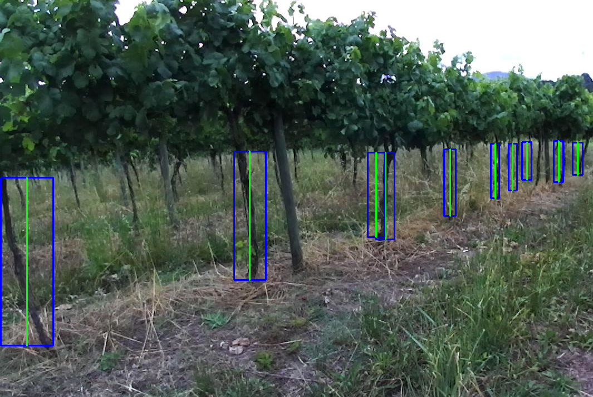
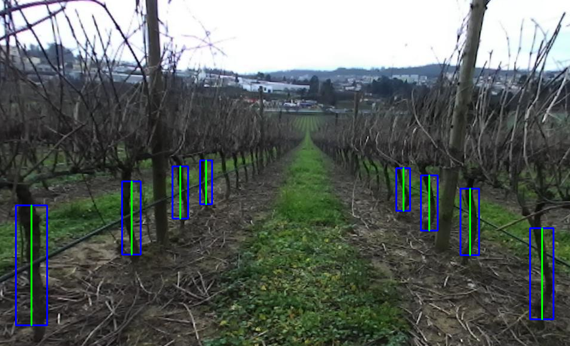
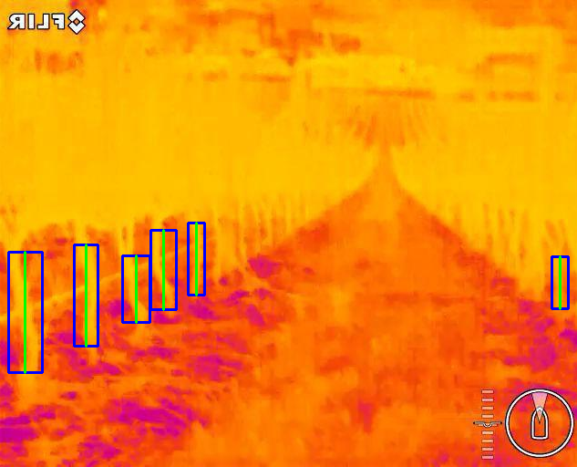
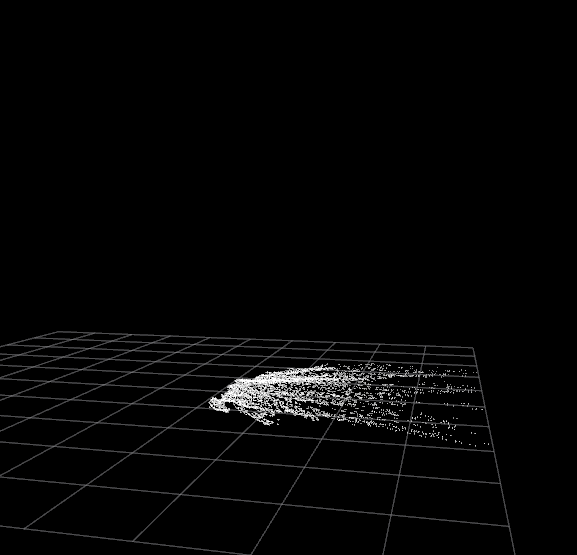
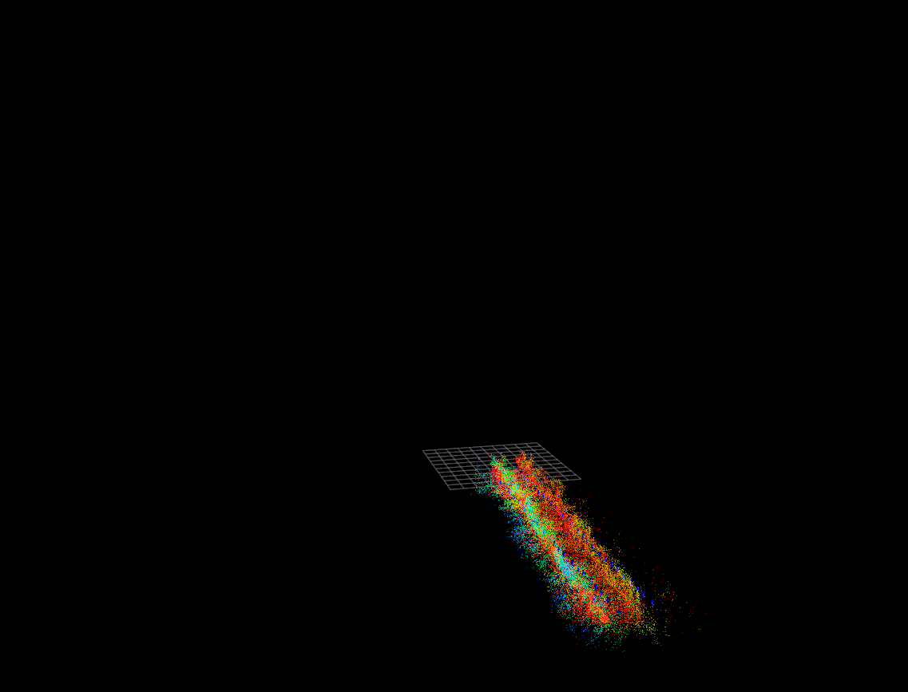
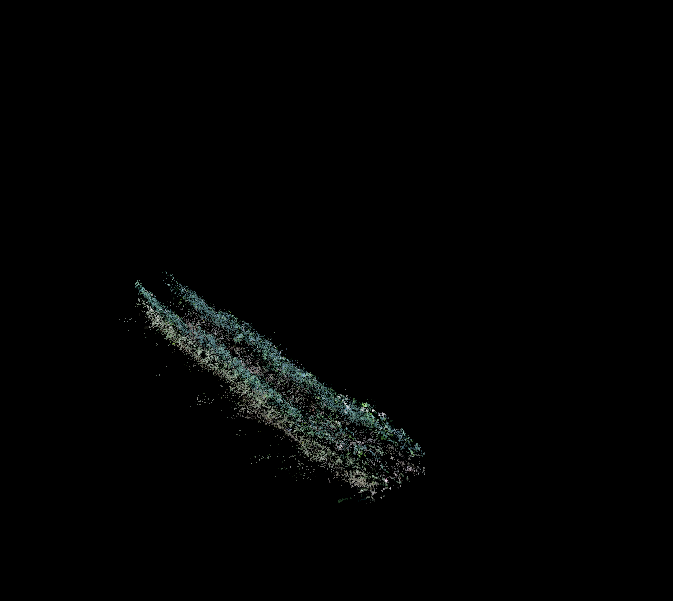
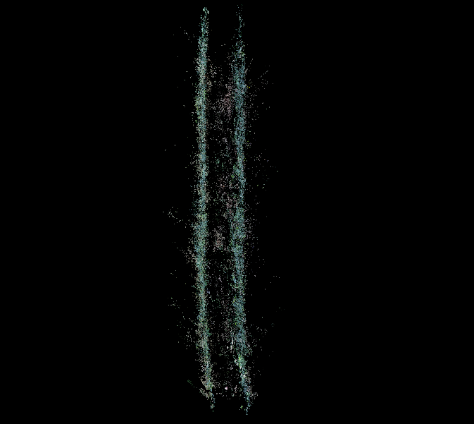
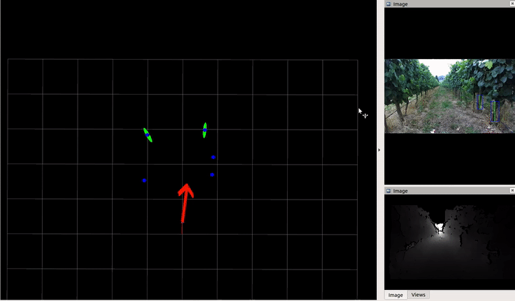

# vineslam

**A multi-layer Localization and Mapping procedure for agricultural places.**

<a href="http://rosin-project.eu">
  
</a>

Supported by ROSIN - ROS-Industrial Quality-Assured Robot Software Components.  
More information: <a href="http://rosin-project.eu">rosin-project.eu</a>

  

This project has received funding from the European Union’s Horizon 2020  
research and innovation programme under grant agreement no. 732287. 

## Table of Contents

1. [System Components](#components)
2. [Setup](#setup)
2. [ROS Structure](#ros)
1. [How to run](#run)
1. [Some results](#results)

## <a name="components"/> System Components

---

### [2D Semantic Map](https://gitlab.inesctec.pt/agrob/tpudetector)

Uses a deep Learning-based object detector to capture semantic features from the
agricultural environment.
* Hardware requirements: [Google's Coral USB Accelerator](https://coral.ai/products/accelerator)

If you use this map layer, please cite our work
```
@article{PintodeAguiar2020,
  doi = {10.1016/j.compag.2020.105535},
  url = {https://doi.org/10.1016/j.compag.2020.105535},
  year = {2020},
  month = aug,
  publisher = {Elsevier {BV}},
  volume = {175},
  pages = {105535},
  author = {Andr{\'{e}} Silva Pinto de Aguiar and Filipe Baptista Neves dos Santos and Lu{\'{\i}}s Carlos Feliz dos Santos and Vitor Manuel de Jesus Filipe and Armando Jorge Miranda de Sousa},
  title = {Vineyard trunk detection using deep learning {\textendash} An experimental device benchmark},
  journal = {Computers and Electronics in Agriculture}
}
```

```
@article{Aguiar2020,
  doi = {10.1109/access.2020.2989052},
  url = {https://doi.org/10.1109/access.2020.2989052},
  year = {2020},
  publisher = {Institute of Electrical and Electronics Engineers ({IEEE})},
  volume = {8},
  pages = {77308--77320},
  author = {Andre Silva Aguiar and Filipe Neves Dos Santos and Armando Jorge Miranda De Sousa and Paulo Moura Oliveira and Luis Carlos Santos},
  title = {Visual Trunk Detection Using Transfer Learning and a Deep Learning-Based Coprocessor},
  journal = {{IEEE} Access}
}
```

#### Example of vine trunk detection

Figueiredo Vineyard | Aveleda Vineyard | Aveleda Vineyard Thermal
:-------------------------:|:-------------------------:|:-------------------------:
 |  | 

### 3D Point Cloud Feature Map

A 3D map with features - **corners** and **planes** directly extracted from a 3D point cloud.

Ground Plane | Other Planes | 3D Map of a Vineyard
:-------------------------:|:-------------------------:|:-------------------------:
 |  | 

### 3D [SURF](https://en.wikipedia.org/wiki/Speeded_up_robust_features) Feature Map

A 3D map built with SURF features detected on the image.

View 1 | View 2 | View 3
:-------------------------:|:-------------------------:|:-------------------------:
 |  | 

## <a name="setup"/> Setup

### Installation

* Apart from the stardard ROS packages this repo uses `vision_msgs`
```
sudo apt install ros-<ROS_VERSION>-vision-msgs
```

* To use the Semantic Feature map layer, please follow the installation instructions [here](https://gitlab.inesctec.pt/agrob/tpudetector).

### Compilation

* First, clone and install the Semantic Feature map layer:
```
git clone https://gitlab.inesctec.pt/agrob/tpudetector
```
* Then, clone and install *vineslam*
```
git clone https://gitlab.inesctec.pt/agrob/vineslam
```
* Compile the system
```
catkin_make -DCMAKE_BUILD_TYPE:=Release
```


## <a name="ros"/> ROS structure

### ROS nodes

* **slam_node** - Simultaneous Localization and Mapping node
* **localization_node** - Localization-only node. Loads a map at the initialization.

### Subscribed topics

* **"/left_image"** ([sensor_msgs::Image](http://docs.ros.org/api/sensor_msgs/html/msg/Image.html)) - the RGB left image
* **"/depth_image"** ([sensor_msgs::Image](http://docs.ros.org/api/sensor_msgs/html/msg/Image.html)) - the disparity map
* **"/detections"**
  ([vision_msgs::Detection2DArray](http://docs.ros.org/api/vision_msgs/html/msg/Detection2DArray.html)) - the object detections
* **"/odom"**
  ([nav_msgs::Odometry](http://docs.ros.org/melodic/api/nav_msgs/html/msg/Odometry.html)) - the robot wheel Odometry
* **"/fix"**
  ([sensor_msgs::NavSatFix](http://docs.ros.org/melodic/api/sensor_msgs/html/msg/NavSatFix.html)) - the GPS topic (optional)

### Published topics

* **"/vineslam/pose"**
  ([geometry_msgs::PoseStamped](http://docs.ros.org/melodic/api/geometry_msgs/html/msg/PoseStamped.html)) - the 6-DoF robot pose
* **"/vineslam/map2D"**
  ([visualization_msgs::MarkerArray](http://docs.ros.org/melodic/api/visualization_msgs/html/msg/MarkerArray.html)) - the 2D semantic map
* **"/vineslam/map3D/SURF"**
  ([sensor_msgs::PointCloud2](http://docs.ros.org/melodic/api/sensor_msgs/html/msg/PointCloud2.html)) - the 3D SURF-based map
* **/vineslam/map3D/corners**
  ([sensor_msgs::PointCloud2](http://docs.ros.org/melodic/api/sensor_msgs/html/msg/PointCloud2.html)) - the 3D PointCloud-based map
  
#### Additional *visualization debug* topics

* **"/vineslam/particles"**
  ([geometry_msgs::PoseArray](http://docs.ros.org/melodic/api/geometry_msgs/html/msg/PoseArray.html)) - the particle filter distribution
* **"/vineslam/path"**
  ([nav_msgs::Path](http://docs.ros.org/melodic/api/nav_msgs/html/msg/Path.html)) - the robot 6-DoF trajectory
* **"/vineslam/map3D/ground"**
  ([sensor_msgs::PointCloud2](http://docs.ros.org/melodic/api/sensor_msgs/html/msg/PointCloud2.html)) - the detected ground plane

### Transforms

* **"base2map"**: "/map" to "/base_link" transform
* **"enu2map"**: "/enu" to "/map" transform (only if using GPS)

### Parameters

To tune the system parameters, you can change them in `./vineslam/config/setup.yaml`

All the parameters are set to their **default values**, so you can run the system witouth changing them.

* **camera_info**:
  * **baseline** - stereo camera baseline (meters)
  * **h_fov** - stereo camera horizontal field of view (degrees)
  * **cam_pitch** - static camera inclination (degrees)
  * **cam_height** - static camera height (meters)
  * **img_width** - image width (pixels)
  * **img_height** - image height (pixels)
  * **fx** - horizontal focal length (pixels)
  * **fy** - vertical focal length (pixels)
  * **cx** - x coordinate of image principal point (pixels)
  * **cy** - y coordinate of image principal point (pixels)

* **multilayer-mapping**:
  * **grid_map**:
    * **origin**:
      * **x** - x coordinate of grid map origin
      * **y** - y coordinate of grid map origin
    * **width** - map width (meters)
    * **height** - map height (meters)
    * **resolution** - map resolution (meters)
    * **metric** - ["euclidean"/"descriptor"] whether to use the euclidean or descriptor distance to find correspondences
    * **save_map** - [True/False] whether to save or not the map when the system ends
    * **output_file** - name of the map output file (.xml)
    * **input_file** - name of the map input file (.xml) if using localization-only
  * **image_feature**:
    * **hessian_threshold** - SURF threshold: the higher the value, the lesser the number of features computed
  * **cloud_feature**:
    * **downsample_factor** - constant to downscale dense disparity image
  * **map_3D**:
    * **max_range** - maximum depth range to consider on 3D maps (meters)
    * **max_height** - maximum points height to consider on 3D maps (meters)
  * **ICP**:
    * **max_iters** - maximum number of iterations of ICP
    * **distance_threshold** - maximum distance to consider point correspondences (meters)
    * **reject_outliers** - [True/False]
    
* **pf**:
  * **n_particles** - number of particles of the particle filter
  * **srr** - motion model rotation/rotation constant (rad/rad)
  * **srt** - motion model rotation/translation constant (rad/meters)
  * **str** - motion model translation/rotation constant (meter/rad)
  * **stt** - motion model translation/translation constant (meter/meter)
  * **sigma_xy** - standard deviation of `[x,y]` components for particles initialization (meters)
  * **sigma_yaw** - standard deviation of `yaw` components for particles initialization (degrees)
  * **sigma_z** - standard deviation of the unobservable component `z` for innovation (meters)
  * **sigma_roll** - standard deviation of the unobservable component `roll` for innovation (degrees)
  * **sigma_pitch** - standard deviation of the unobservable component `pitch` for innovation (degrees)
  * **sigma_landmark_matching** - stardard deviation of the Deep Learning-based Semantic perception (meters)
  * **sigma_feature_matching** - standard deviation of the SURF features mapping (meters)
  * **sigma_corner_matching** - standard deviation of the PointCloud features mapping (meters)
  * **sigma_ground_rp** - standard deviation of the ground plane mapping (meters)
  * **sigma_gps** - standard deviation of the GPS message (meters)
  * **k_clusters** - number of clusters to consider at the end of the particle filter

## <a name="run"/> How to run

* You can use the already implemented `launch` files to each node.
* If you want to use your own topics, just edit them and remap the topics.
* *SLAM node*:
```
roslaunch vineslam_ros test_slam.launch
```
* *Localization node*:
```
roslaunch vineslam_ros test_localization.launch
```

## <a name="results"/> Some results

Some visual results of each the SLAM system mapping each one of the three maps, simultaneously.

2D Semantic Vine Trunk Map | 3D PointCloud Corners Map | 3D SURF Features Map
:-------------------------:|:-------------------------:|:-------------------------:
 |  | 
