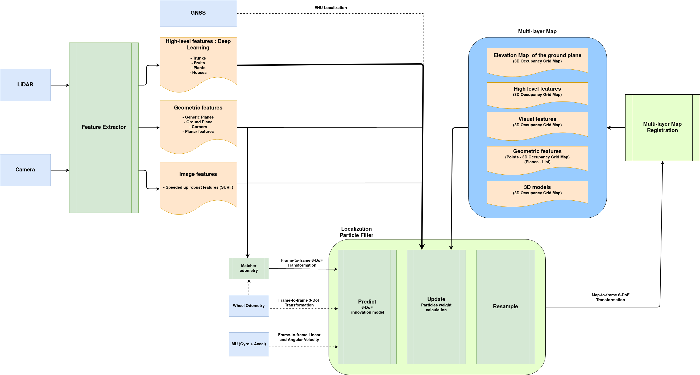
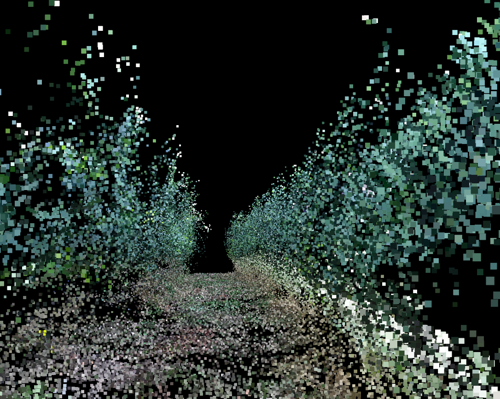
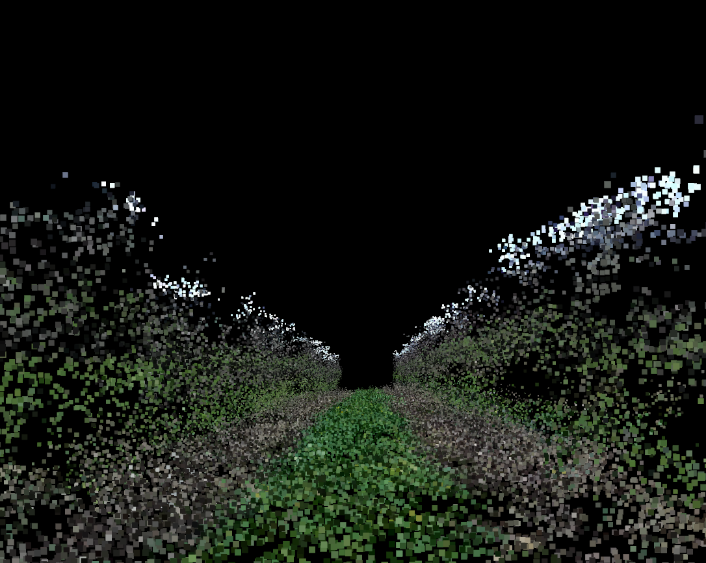

# VineSLAM

**A multi-layer Localization and Mapping procedure for agricultural places.**

<a href="http://rosin-project.eu">
  
</a>

Supported by ROSIN - ROS-Industrial Quality-Assured Robot Software Components.  
More information: <a href="http://rosin-project.eu">rosin-project.eu</a>


This project has received funding from the European Union’s Horizon 2020  
research and innovation programme under grant agreement no. 732287.

## Table of Contents

1. [System architecture](#architecture)
2. [System components](#components)
3. [Setup](#setup)
4. [ROS structure](#ros)
5. [How to run](#run)

## <a name="architecture"/> System architecture

#### VineSLAM relies on three main software blocks:

* **Feature extractor**: computes *high-level semantic features*, *geometric features*, and *image features*.
* **Multi-layer map**: considers all the extracted features to build *individual maps* that together constitute a novel
  3D multi-layer map.
* **Localization**: Particle filter that uses the *feature extractor* and the *multi-layer map* to localize the robot.

<p align="center">

</p>

## <a name="components"/> System components

---

### [Semantic Map](https://gitlab.inesctec.pt/agrob/tpudetector)

Uses a deep Learning-based object detector to capture semantic features from the
agricultural environment.
* Hardware requirements: [Google's Coral USB Accelerator](https://coral.ai/products/accelerator)

#### Example of vine trunk detection

Figueiredo Vineyard | Aveleda Vineyard | Aveleda Vineyard Thermal
:-------------------------:|:-------------------------:|:-------------------------:
 |  | 

### Geometric maps

A 3D map with features - **corners**, **planars** and **semi-planes** directly extracted from a 3D point cloud.

* **Corner features maps**

[](https://youtu.be/QKrOnOlvLEQ)

* **Planar features maps**

[](https://youtu.be/4nrELtalvYU)

* **Semi-plane features maps**

[](https://youtu.be/ANISWolZIx8)

### Elevation Map

Elevation map extracted from the ground plane. It considers a well-defined grid map structure with altitude information
for each cell.

[](https://youtu.be/3LDqRQFx-00)

### Visual maps

A 3D map built with SURF features detected on the image.

<p float="left">
  
</p>
<p float="left">
  
</p>


## <a name="setup"/> Setup

### Installation

* To install the VineSLAM package, follow the instructions detailed [here](./docs/installation.md).

* To use the Semantic Feature map layer, clone the following repo:

```
git clone https://gitlab.inesctec.pt/agrob/tpudetector
```

and then follow the instruction provided [here](https://gitlab.inesctec.pt/agrob/vineslam_stack/tpudetector).

## <a name="ros"/> ROS structure

VineSLAM requires many input topics from sensor data, and outputs many topics (robot pose and maps). Also, some
parameters can be tuned to improve its performance. All this information is summarized in
the [configuration file description](./docs/ros_structure.md).

## <a name="run"/> How to run

* You can use the already implemented `launch` files to each node.
* If you want to use your own topics, just edit them and remap the topics.
* *SLAM node*:

```
roslaunch vineslam_ros test_slam.launch
```

* *Localization node*:

```
roslaunch vineslam_ros test_localization.launch
```